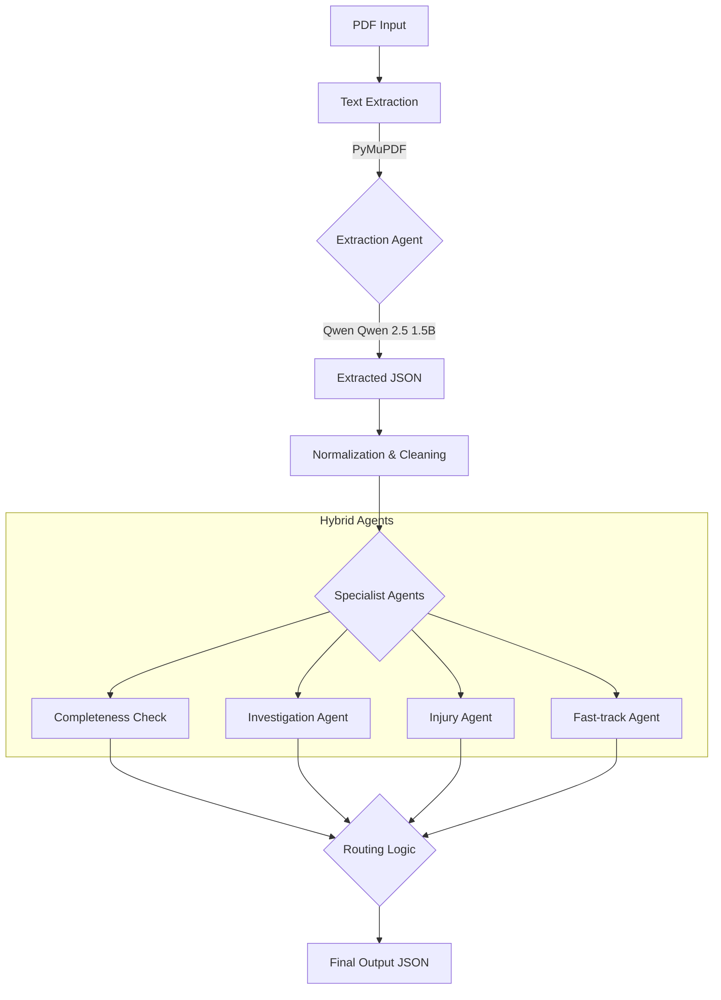

# FNOL Claims Processing Agent (Local LLM Hybrid)

A **high-performance, offline-first** First Notice of Loss (FNOL) claims processing system. It combines **Local LLMs (Qwen 2.5 1.5B)** with deterministic Python logic to achieve both flexibility and reliability.

## 🚀 Features

- **100% Offline & Private**: Runs entirely on your local machine using `llama.cpp`. No API keys or data leakage.
- **Hybrid Agent Architecture**:
    -   **LLM Reasoning**: Uses Qwen 1.5B to understand context (e.g., "Is this fraudulent?", "Is this an injury?").
    -   **Rule Fallback**: Automatically falls back to keyword/regex logic if the LLM is unsure.
- **Fast PDF Extraction**: Uses `PyMuPDF` for instant text extraction (<0.1s).
- **Intelligent Routing**: Automatically classifies claims into:
    -   ✅ **Fast-track** (Low value, complete data)
    -   🚩 **Investigation** (Fraud indicators)
    -   🚑 **Specialist** (Injury claims)
    -   📝 **Manual Review** (Missing info)

---

## 🏗️ Architecture Flow



---

## 🛠️ Setup & Prerequisites

### 1. Requirements
- **Python 3.10+**
- **Git**
- **8GB+ RAM** (Recommended)
- **Visual Studio Build Tools** (Windows only - for compiling `llama-cpp-python`)

### 2. Installation
```powershell
# Clone the repository
git clone https://github.com/krishnaman2003/fnol-claims-processor.git
cd fnol-claims-processor

# Install dependencies
pip install -r requirements.txt
```

### 3. Model Setup (Critical)
You need to download the quantized Qwen model (~1.1GB).

1.  Create the folder: `src/model/`
2.  Download **`qwen2.5-1.5b-instruct-q4_k_m.gguf`** from [HuggingFace](https://huggingface.co/Qwen/Qwen2.5-1.5B-Instruct-GGUF).
3.  Place it at: `src/model/qwen2.5-1.5b-instruct-q4_k_m.gguf`

---

## 🏃‍♂️ End-to-End Walkthrough

### Step 1: Place your PDF
Put your FNOL document (PDF) in the `src/data/` folder.
*Example included:* `src/data/ACORD-Automobile-Loss-Notice-12.05.16.pdf`

### Step 2: Run the Agent
```powershell
python src/main.py
```

### Step 3: View Results
The script will output `claim_processed_output.json`.

**Example Output:**
```json
{
  "extractedFields": {
    "Policy Information": { ... },
    "Incident Information": {
      "Description": "Rear-ended by another driver. Neck pain."
    }
  },
  "recommendedRoute": "Specialist Queue",
  "reasoning": "Claim type indicates injury."
}
```

---

## 🧠 Hybrid Agent Logic

This system uses a "belt and suspenders" approach:

| Agent | LLM Check (Primary) | Fallback Logic (Safety) |
|-------|---------------------|--------------------------|
| **Investigation** | "Analyze description for fraud markers like 'staged', 'inconsistent'." | Checks for keywords: `fraud`, `staged`, `inconsistent` |
| **Injury** | "Does this claim description imply bodily injury?" | Checks if `Claim Type` field contains "injury" |
| **Fast-track** | "Is the damage amount clearly under $25k?" | Regex number parsing `< 25000` |
| **Completeness** | "Are mandatory fields missing or effectively empty (N/A)?" | Checks for `null` or empty strings |

---

## 📂 Project Structure

```
src/
├── main.py              # CORE: Orchestrator, Agents, LLM Setup
├── pdf_extraction.py    # UTILITY: Fast PDF text extraction
├── data/                # INPUT: Place PDFs here
├── model/               # MODEL: Place .gguf file here
└── requirements.txt     # DEPS: Python libraries
```
